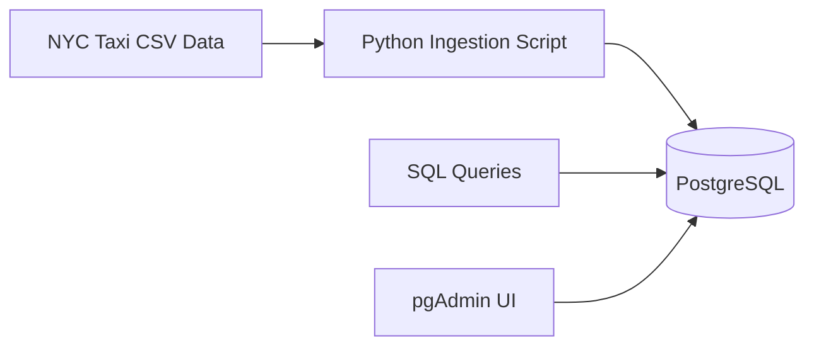

# 🚀 Module 01 — Docker, SQL & Terraform

## Objective

Build a local, reproducible data ingestion environment using Docker, ingest [NYC Taxi data](https://www.nyc.gov/site/tlc/about/tlc-trip-record-data.page) into PostgreSQL, explore it using SQL, and introduce Infrastructure as Code concepts with Terraform.

Establish the foundation for all downstream orchestration, analytics, and streaming work.


## What Was Built

- Dockerized PostgreSQL database
- pgAdmin for database inspection
- Python ingestion script for NYC Taxi data
- SQL-based data exploration
- Terraform project structure (foundations, no cloud resources applied)


## Architecture



## Project Structure

```text
01-docker-terraform/
├── README.md
├── docker-sql/
│   └── pipeline/
│       ├── pipeline.py
│       ├── Dockerfile
│       ├── docker-compose.yaml
│       ├── docker_commands.sh
│       ├── notebook.ipynb
│       ├── ingest_data.py
│       ├── uv.lock
│       └── pyproject.toml
├── terraform-gcp/
│   └── terrademo/
│       ├── main.tf
│       ├── variables.tf
└       └── .terraform.lock.hcl
```

## Technologies Used

- Docker & Docker Compose

- PostgreSQL

- pgAdmin

- Python

- SQL

- Terraform (project scaffolding)

## Docker & PostgreSQL

- PostgreSQL — primary OLTP store

- pgAdmin — UI for inspection and queries

- Python ingestion container — batch loads CSV → Postgres

All services are orchestrated via docker-compose.

## How to Run Locally

```bash
cd 01-docker-terraform/docker-sql/pipeline
docker compose up -d
```

### Verify containers:

```bash
docker compose ps
```

### Access pgAdmin:

- URL: http://localhost:8085

- Email: admin@admin.com

- Password: root

## Data Ingestion

The ingestion script performs:

- CSV download (NYC Taxi Open Data)

- Chunked reads for memory efficiency

- Schema-aware inserts into PostgreSQL

- Explicit dtype handling for timestamps and numerics

### Key file:

```bash
docker-sql/pipeline/ingest_data.py
```


## Terraform (Foundational)

Terraform is introduced conceptually to establish:

- Project Structure

- Model layout

- Provider configuration patterns

## Key Learnings

- Docker removes environment inconsistencies

- Databases should always run in containers locally

- Never commit data, secrets, or virtual environments

- Infrastructure should be declarative from day one
  
